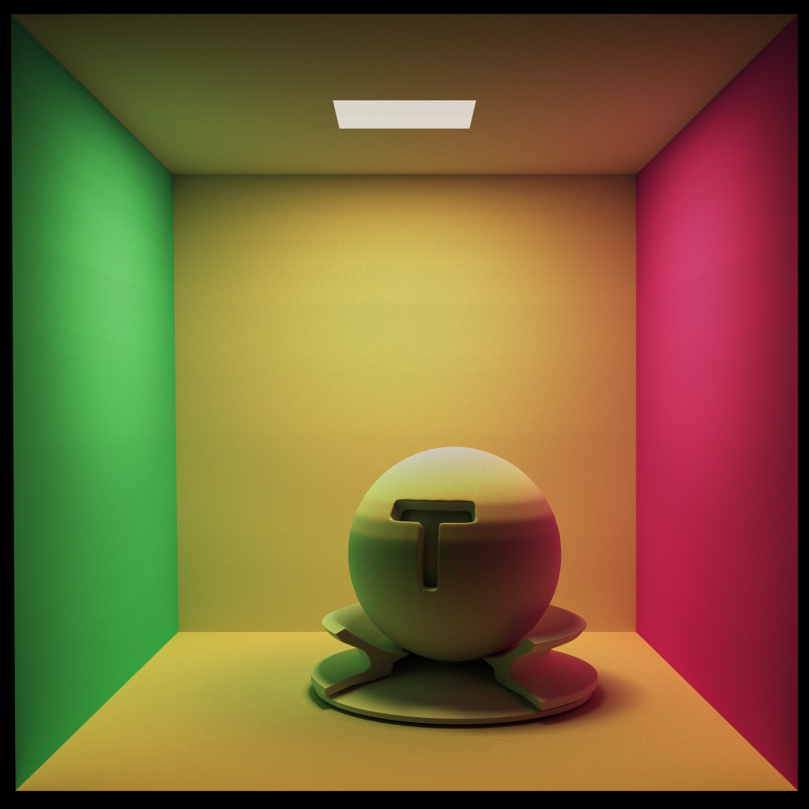
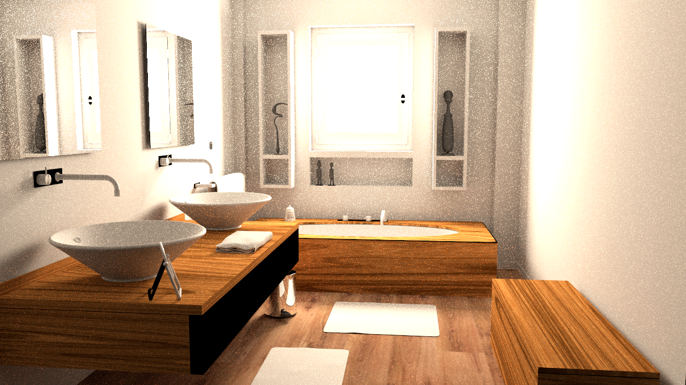
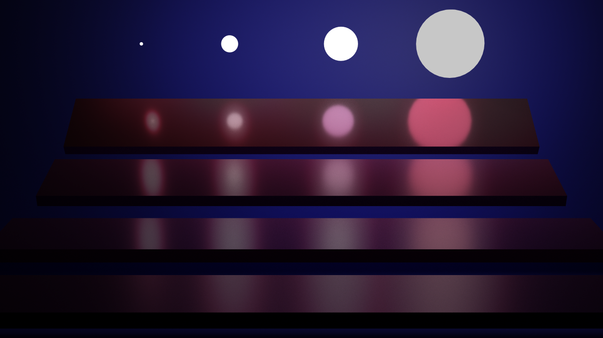

# MonteCarloPathTracer

> 从零实现的 CPU 蒙特卡洛路径追踪器：C++17 + SAH BVH + NEE/MIS + Owen-scrambled Sobol，
> 不依赖任何图形 API 与外部库（glm / stb / tinyxml2 随仓库提供）

一个从零实现的 **CPU 蒙特卡洛路径追踪器**：SAH BVH + 下一事件估计（NEE）与多重重要性采样（MIS）、
Owen-scrambled Sobol 低差异采样、HDR 线性累加与可切换色调映射、俄罗斯轮盘赌；全部使用 C++17
标准库实现，第三方仅 glm / stb / tinyxml2（随仓库附带，位于 include/）。

> A from-scratch CPU Monte Carlo path tracer in C++17: binned-SAH BVH, next-event estimation with
> multiple importance sampling, Owen-scrambled Sobol sampling, HDR accumulation with ACES / Reinhard /
> linear tone mapping and sRGB output, Russian roulette, XML-described scenes, and a small CLI.

## 效果图

| Cornell Box（1024 spp） | Bathroom 2（1024 spp） | Veach MIS（1024 spp） |
| --- | --- | --- |
|  |  |  |

同目录下还有课程参考图（`results/cornell-box-standard.png`、`results/bathroom2-standard.png`、
`results/veach-mis-stardand.png`）以及每个场景 8 / 16 / 32 / 64 / 256 / 1024 spp 的渲染结果。

## 核心特性

**采样与积分**
- 路径追踪 + 下一事件估计（NEE），光源采样与 BSDF 采样用 **power heuristic 的 MIS** 组合
- 面积光源（三角形网格）按面积加权采样，光源 PDF 换算到立体角
- 理想 δ 镜面单独成支路，避免 GGX 叶瓣抖动在镜面像素上的巨大方差
- **俄罗斯轮盘赌**：按累计吞吐量决定存活概率并按概率补偿权重（保持无偏）
- Owen-scrambled Sobol 序列（hash-based 方案），纹理/材质维度用哈希打散

**几何与加速结构**
- 三角形 BVH：单遍分箱 SAH 构建（每轴 11 个候选平面），叶子最多 10 个三角形
- 叶子三角形存放在全局扁平数组，节点包围盒内联存储（遍历时无指针跳转）
- OBJ 加载：整文件读入 + 手写扫描解析（`strtof/strtol`），面片索引与顶点为值语义
- 背面剔除，避免开放场景的墙壁把路径"漏"到场景外

**材质与光源**
- Phong 系 MTL 语义：`Kd` → 漫反射、`Ks` → 菲涅尔 F0、`Ns` → 微表面平方粗糙度 `a2 = clamp(2/(Ns+2))`
- 纯镜面与"漫反射 + 高光"混合材质，混合项采用能量守恒的 `(1-F)` 形式
- 支持 `map_Kd` 贴图；光源以带辐射亮度的材质参与采样

**成像管线**
- 线性 HDR 累加（不做截断），渲染结束后统一走 **曝光 → 色调映射（linear / ACES / Reinhard）→ sRGB**
- 逐场景可配曝光与色调曲线；输出 8bit PNG，`--save-hdr` 可另存线性 Radiance `.hdr`

**工程**
- 场景用 XML 描述（相机、分辨率、光源、背景、曝光、色调曲线）
- 32x32 tile 多线程渲染，`--threads N` 可限制并发；固定种子下结果可复现
- CMake 构建（MSVC / clang / gcc），同时保留 Visual Studio 工程

## 构建与运行

依赖：C++17 编译器（MSVC 2019+/clang 10+/gcc 9+）、CMake 3.16+（可选，也可直接用 Visual Studio
打开 `MonteCarloPathTracer.sln`）。除此之外**不需要任何外部依赖**：glm / stb / tinyxml2 都在
`include/` 下随仓库提供。

```bash
# Linux / macOS / Ninja
cmake -S . -B build -DCMAKE_BUILD_TYPE=Release
cmake --build build -j

# Windows + Visual Studio（VS 2022 生成器名同理）
cmake -S . -B build -G "Visual Studio 18 2026" -A x64
cmake --build build --config Release -j
```

可选开关 `-DMCPT_NATIVE_OPT=ON` 会追加 `-O3 -march=native`（MSVC 为 `/arch:AVX2`）：
本机自用可再快约 6%~11%，但会牺牲二进制可移植性、且不同机器/编译器的浮点结果不再逐字节一致。

程序用**相对路径**读取 `models/`、写入 `results/`，因此请**从仓库根目录运行**：

```bash
./build/Release/MonteCarloPathTracer.exe -s bathroom2 -n 256          # 256spp 渲染 bathroom2
./build/Release/MonteCarloPathTracer.exe -s cornell-box -n 8 -W 320 -H 320 -o out -q
```

## 使用方式

本程序是命令行工具，参数取值优先级为：命令行 > 场景 XML > 内置默认。

### 命令行参数

取值优先级：**命令行 > 场景 XML > 内置默认**。

| 参数 | 说明 | 默认 |
| --- | --- | --- |
| `-s, --scene <名称>` | 使用 `models/<名称>/<名称>.obj` 与 `.xml` | `cornell-box` |
| `--obj <路径>` / `--xml <路径>` | 直接指定模型/场景文件（覆盖 `--scene` 推导） | — |
| `-n, --spp <整数>` | 每像素采样数 | `16` |
| `-W, --width` / `-H, --height <整数>` | 输出分辨率（覆盖 XML） | 取 XML |
| `-o, --out <目录>` | 结果目录，不存在会自动创建 | `results` |
| `--exposure <浮点>` | 曝光系数（覆盖 XML） | 取 XML |
| `--tonemap <模式>` | `linear` / `aces` / `reinhard` | 取 XML |
| `--max-depth <整数>` | 最大弹射深度 | `16` |
| `--rr <on\|off>` | 俄罗斯轮盘赌 | `on` |
| `--threads <整数>` | 渲染线程数，`0` 表示每个 tile 一个线程 | `0` |
| `--save-hdr` | 额外保存线性 Radiance `.hdr` | 关闭 |
| `--no-save` | 只渲染不写文件 | 关闭 |
| `-q, --quiet` | 只输出一行可脚本解析的统计 | 关闭 |
| `-h, --help` | 用法与默认值 | — |

```bash
# 批量为多档 spp 采集耗时（-q 的行格式见下）
for n in 8 16 32 64 256 1024; do
  ./build/Release/MonteCarloPathTracer.exe -s bathroom2 -n $n --no-save -q
done

# 输出示例：scene=bathroom2 faces=1243943 spp=16 size=1280x720 load_ms=803.4 bvh_ms=956.0 render_ms=6970.2 png=-
```

### 场景配置（XML）

```xml
<scene>
  <camera type="perspective" width="1280" height="720" fovy="35.9834"
          exposure="250" tonemap="linear" specularBlend="0">
    <eye    x="4.4431" y="16.9344" z="49.9102"/>
    <lookat x="-2.5735" y="9.9918" z="-10.5882"/>
    <up     x="0"      y="1"      z="0"/>
  </camera>
  <light mtlname="Light" radiance="125.0,100.0,75.0"/>
  <!-- 可选：环境/背景辐射亮度（线性）；缺省为全黑 -->
  <background radiance="1,1,1"/>
</scene>
```

| 元素/属性 | 含义 | 缺省 |
| --- | --- | --- |
| `width` / `height` | 分辨率（可被 `-W/-H` 覆盖） | 必填 |
| `fovy` | 垂直视场角（度） | 必填 |
| `exposure` | 曝光系数，先曝光再做色调映射 | `300` |
| `tonemap` | `linear`（截断）/ `aces` / `reinhard` | `aces` |
| `specularBlend` | 混合材质菲涅尔的插值：`F0 = mix(0.04, Ks, blend)` | `0.25` |
| `<light mtlname radiance>` | 把指定材质变成面积光源；若该材质 `Kd>0` 则亮度再乘 `Kd` | — |
| `<background radiance>` | 射线飞出场景时返回的辐射亮度 | 全黑 |

材质使用 MTL（Wavefront）描述，映射关系：

| MTL 关键字 | 含义 |
| --- | --- |
| `Kd` | 漫反射反照率（可选 `map_Kd` 贴图） |
| `Ks` | 镜面反射的菲涅尔 F0（`Ks=0` 为纯漫反射，`Kd=0 且 Ks>0` 为纯镜面） |
| `Ns` | Phong 指数，映射为微表面平方粗糙度 `a2 = clamp(2/(Ns+2), 1e-4, 1)` |
| `Tr` / `Ni` | 已解析进材质结构，但当前未参与着色（留给后续透射/折射） |

## 实现要点

**BVH 构建**（`src/bvh.cpp`）
- 单遍分箱 SAH：每轴 11 个候选平面（`minCenter + k*step`，`step=(maxCenter-minCenter)/11`），
  一趟遍历归箱并累计每个箱的包围盒与计数，再用前后缀扫描评估所有候选平面；
  候选平面按原实现的 `axis += step` 逐步累加方式生成，连浮点累加误差一并复现
- 叶子三角形存进全局扁平数组，节点内的包围盒为值语义（遍历无指针跳转）
- 实测：bathroom2（124 万面）构建耗时 2.9s → **0.9s**

**渲染循环**（`src/pathTracer.cpp`）
- 每个像素先用像素索引初始化采样器（固定种子 → 多线程下仍可复现），再逐样本走 `trace()` 递归
- `trace()`：命中光源（深度 0 直接取，否则按 MIS 加权）→ 背面剔除 → `shuffle()` →
  NEE 直接光 → BSDF 采样 → 俄罗斯轮盘赌 → 递归
- 光源可见性采用**距离判定**而非"命中面 id"：Cornell box 的光源面与天花板面共面，阴影射线在两者上的
  `t` 完全相同，用 id 判定会让约 **36.7%** 的光源样本被误判为遮挡，且结果依赖 BVH 叶内顺序；
  改为"最近的遮挡物不比光面更近即认为可见"后降到 **6.9%**

**采样器**（`src/sampler.cpp`）
- Owen-scrambled Sobol 序列（hash-based Owen scramble + Laine-Karras 哈希）
- `get1D/get2D` 只用 8 个 Sobol 维度；俄罗斯轮盘赌另用 `getRandom(salt)`（复用位反转索引、
  换一套 scramble 键），既不占用也不污染已有维度

**成像**（`src/pathTracer.cpp`）
- `m_hdrImage` 线性累加 → 曝光 → 色调映射 → sRGB → 8bit PNG；每个 tile 独立计算，
  因此**线程数与调度方式不影响结果**（固定种子下逐字节一致）

## 性能数据

加载与 BVH 构建（每次运行首阶段实测，Windows / MSVC + clang 各测一致）：

| 模型 | 面数 | OBJ 加载 | BVH 构建 |
| --- | --- | --- | --- |
| veach-mis | 3,092 | 2.1 ms | 1.4 ms |
| cornell-box | 80,652 | 42 ms | 56 ms |
| bathroom2 | 1,243,943 | 830 ms | 892 ms |

渲染时间（墙钟；渲染线程数约 32，CPU 时间约为墙钟的 26~27 倍）：

| spp | 8 | 16 | 32 | 64 | 256 | 1024 |
| --- | --- | --- | --- | --- | --- | --- |
| veach-mis（1280x720） | 2.20 s | 4.45 s | 10.42 s | 21.31 s | 90.93 s | 338.66 s |
| cornell-box（1024x1024） | 1.88 s | 3.69 s | 7.66 s | 14.90 s | 58.78 s | 291.17 s |
| bathroom2（1280x720） | 3.31 s | 6.97 s | 15.56 s | 23.64 s | 94.64 s | 487.38 s |

多线程加速比（bathroom2、8spp、640x360、只计渲染时间、每档 2~3 次取最小；本机 32 逻辑处理器）：

| 线程数 | 1 | 2 | 4 | 8 | 16 | 32 |
| --- | --- | --- | --- | --- | --- | --- |
| 渲染 | 13463 ms | 7538 ms | 3590 ms | 1614 ms | 1075 ms | 960 ms |
| 加速比 | 1.00x | 1.79x | 3.75x | **8.34x** | 12.5x | **14.0x** |

主要优化与其效果：SAH 单遍分箱（构建 −49%）、包围盒内联与叶子扁平化（渲染 −5%~−11%）、
OBJ 解析重写（加载 −78%）、俄罗斯轮盘赌 + 深度上限 16（CPU −26%~−42%）。

## 正确性验证

- **解析式测试**：封闭白炉、以及"球面光源 ≡ 等效面光源"的 NEE 一致性（差异 < 0.7%）
- **固定种子复现**：同一配置多次渲染逐字节一致；不同线程数与不同调度（`--threads 1/3/7/0`）
  同样逐字节一致，这是所有 A/B 回归的基础
- **A/B 回归**：性能类改动要求逐字节不变（包围盒内联、叶子扁平化等均为 0 差异）；
  必然改变图像的改动（如 NEE 判定修复）则用 MAE、p95、亮区面积等统计量对比
- **线性域比对**：`--save-hdr` 输出的 `.hdr` 用于避免 8bit sRGB 反解引入的误差

## 已知限制与后续工作

### 当前限制

- veach-mis 相对参考图仍有约 20% 的整体亮度差与约 4% 的取景差异，尚未解决
- 混合材质的 `specularBlend` 是在 `F0=0.04` 与 `F0=Ks` 之间插值以贴合参考图，属工程折中而非严格物理
- 尚无透射/折射（玻璃）、降噪、SIMD/包式遍历；贴图仅支持 `map_Kd`
- 光源可见性改用距离判定后对共面几何免疫，但相机射线在该区域仍有 z-fighting（建议把场景改成"天花板开洞"）

### 后续工作

1. **定位 veach-mis 的残差**：约 20% 的整体亮度差与约 4% 的取景差异（先对齐相机与几何，再查采样/权重）
2. **透射与折射**：MTL 的 `Tr` / `Ni` 已解析进材质，补上玻璃支路即可
3. **降噪**：曾实现过双边滤波（见 git 历史），可作为 "低 spp + 降噪" 的对比实验
4. **SIMD / 包式遍历**：目前是标量遍历，可先做叶子内 4 三角形的 SoA 版本

## 目录结构

```
.
├── CMakeLists.txt                      # CMake 构建（MSVC / clang / gcc）
├── MonteCarloPathTracer.sln/.vcxproj   # Visual Studio 工程
├── src/                                # 渲染器源码（23 个文件）
│   ├── pathTracer.*                    # 路径追踪主体、成像管线
│   ├── bvh.* / boundingbox.hpp         # SAH BVH 构建与遍历
│   ├── intersection.* / material.hpp   # 求交、BRDF 与材质
│   ├── sampler.*                       # Owen-scrambled Sobol 采样器
│   ├── scene.* / camera.* / light.*    # XML 场景、相机、面积光源
│   ├── model.*                         # OBJ/MTL 加载与模型数据
│   └── main.cpp                        # 命令行入口
├── include/                            # glm / stb / tinyxml2（第三方，随仓库提供）
├── models/                             # cornell-box / bathroom2 / veach-mis
└── results/                            # 各 spp 渲染结果与课程参考图
```

## 参考

- Burley. *Practical Hash-based Owen Scrambling*. JCGT 2020（采样器实现依据）
- Joe, Kuo. *Constructing Sobol sequences with better two-dimensional projections*（方向数来源）
- Vegdahl. *Building a better Laine-Karras hash*（scrambler 哈希）
- Veach. *Robust Monte Carlo Methods for Light Transport Simulation*. 1997（MIS 与 power heuristic）
- Pharr, Jakob, Humphreys. *Physically Based Rendering*（路径追踪与 MIS 的通用参考）
- 课程提供的参考图：`results/cornell-box-standard.png`、`results/bathroom2-standard.png`、`results/veach-mis-stardand.png`
